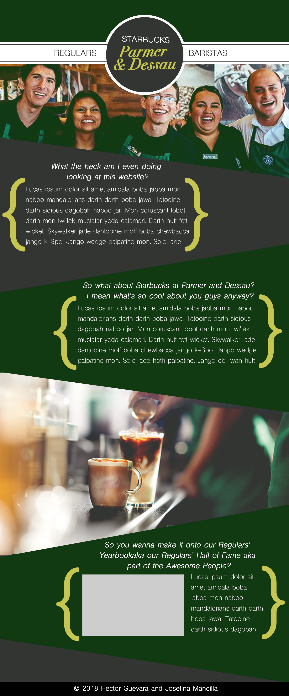
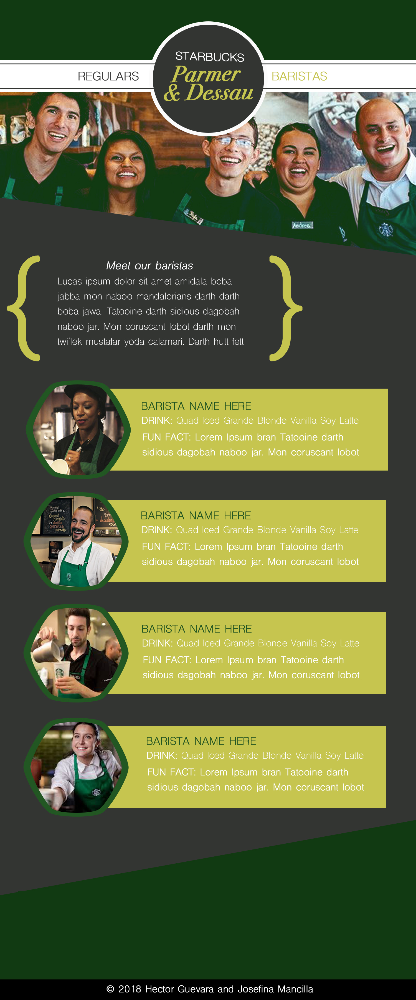

# Starbucks at Parmer and Dessau Yearbook App
An online "yearbook" of the Starbucks at Parmer and Dessau's (Austin, Tx) regular customers, created for and by baristas in order to make memories and recognize valued customers.

## Inspiration, Planning and Wireframes
The idea of this app was born out of a small moment with some of my coworkers and customers. You could say it was really born over several months, because it was over those first 6 months of opening our Starbucks location, that we, the baristas, developed the relationships that inspired this app. One of the many cool things about having meaningful interactions with our regulars is that you really get to come to know what makes each of them unique. During a slow afternoon shift, some of my coworkers and I got to talking about the different people that come in and their style, their personality, their jobs, etc. We started voting people "best dressed", and other things like that, which you normally see in your typical high school yearbooks. That's when we decided to make an "online yearbook" that we could keep as a memory of our times at Starbucks, both with our coworkers and our regulars. This was something that we hoped to share with the customers as well.

I then started wireframing what I wanted the app to look like. I initially sketched everything and then used Photoshop to come up with a better draft. Part of what helped me organize the information I knew I wanted was based off of what we call our "North Star" books. These are notebooks that each barista receives upon being hired, and there's a section on there where you can add a fun fact and usual drink order for customers you are close to. I wanted our yearbook app to work in a similar manner, but also be more visual, in hopes that this would also be a unique experience for the customers since they could eventually see the many faces that come and get coffee at the same Starbucks.

## Deployment
This app is still in the process of being built, and is not yet deployed.

## Built With

* **Express** - *Used to create the backend API.*
* **Angular** - *Used to create the application pages.*
* **Mongoose** - *Used to create and manage the data.*
* **Mongo** - *Used to create and manage the data.*
* **HTML** - *Used with angular.*
* **JavaScript** - *Used with Angular and Express.*
* **CSS** - *Used to style the pages.*
* **[Bootstrap](https://getbootstrap.com/)** - *Used to style the pages.*
* **[Animista](http://animista.net/)** - *Used to add CSS animations.*
* **Atom** - *Used as text editor.*
* **[Font Awesome](http://fontawesome.io/)** - *Used for glyphicons on buttons.*

## Contributing

For contribution, email me, [Josefina Mancilla](josefinanoemi4@gmail.com).

## Authors
* **Josefina Mancilla** - [jnm2377](https://github.com/jnm2377)
* **Hector Guevara** - [hectorlito](https://github.com/hectorlito)

## Acknowledgments

* StackOverflow.
* Special thanks to all the great baristas and customers that inspired this app.
